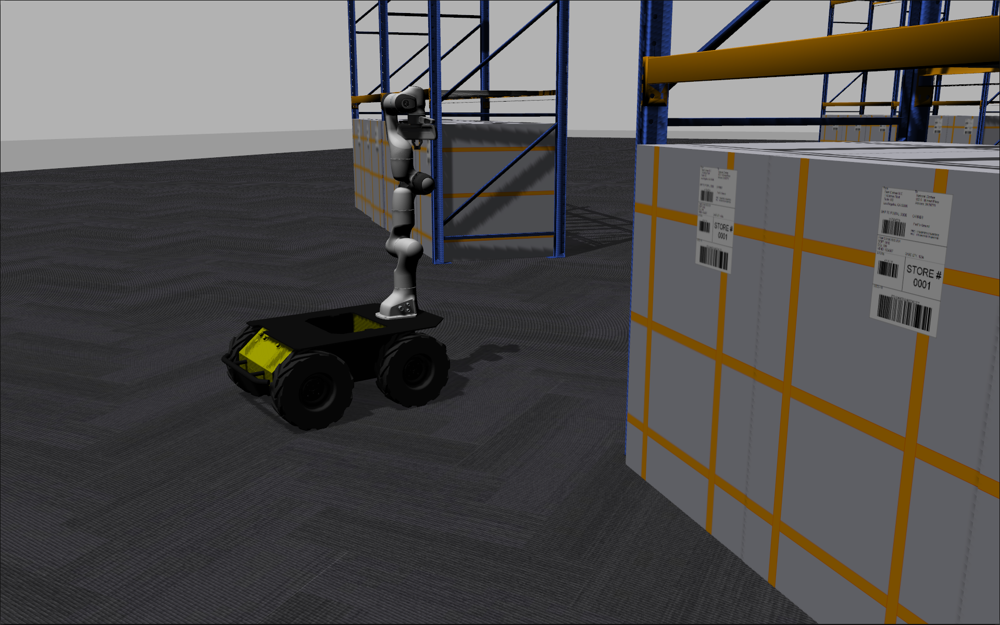

# FKIE Husky Manipulation Simulation 

## Description

The <code>fkie_husky_manipulation_simulation</code> package simulates a husky robot base and a manipulator arm such as a panda arm.



## Requirements
This package has been tested on Ubuntu 20.04 and ROS Noetic with Gazebo 11.

## Installation
- Install all the dependencies

```console
sudo apt install ros-noetic-franka-description ros-noetic-gazebo-ros-control ros-noetic-gazebo-ros-pkgs ros-noetic-husky-control ros-noetic-husky-description ros-noetic-jsk-rviz-plugins ros-noetic-ros-control
```

- Clone and build the following packages with catkin build. 
  https://github.com/fkie/fkie_realsense_description https://github.com/fkie/realsense_gazebo_plugin https://github.com/fkie/fkie_husky_manipulation_simulation

```console
cd <your_ros_workspace>/src
git clone https://github.com/fkie/fkie_realsense_description
git clone https://github.com/fkie/realsense_gazebo_plugin
git clone https://github.com/fkie/fkie_husky_manipulation_simulation
catkin build fkie_husky_manipulation_simulation
```
## Try it out!
We highly recommend using [fkie_node_manager](https://github.com/fkie/multimaster_fkie/tree/master/fkie_node_manager) for managing the ROS nodes. 

- ```demo_warehouse.launch```: Launches husky robot base with a panda arm in an warehouse environment used in the RA-L [publication](https://ieeexplore.ieee.org/abstract/document/9695293).
```
roslaunch fkie_husky_manipulation_simulation demo_warehouse.launch
```
## Acknowledgements
Our work uses [husky robot](https://github.com/husky/husky) and the [panda arm](https://github.com/frankaemika/franka_ros) packages. 

Thanks to these [discussions](https://github.com/justagist/panda_simulator/discussions/44) and [Erdal's blog](https://erdalpekel.de/?p=55) for tips on panda arm integration with Husky robot in Gazebo.

All the gazebo simulation environments that were used for simulations in the [RA-L article](https://ieeexplore.ieee.org/abstract/document/9695293) and ICRA 2022 conference paper. The models are from [osrf/gazebo_models repository](https://github.com/osrf/gazebo_models).

## Authors
```
Menaka Naazare 
menaka.naazare@fkie.fraunhofer.de

Francisco Garcia Rosas
francisco.garcia.rosas@fkie.fraunhofer.de

Fraunhofer FKIE 2022
```